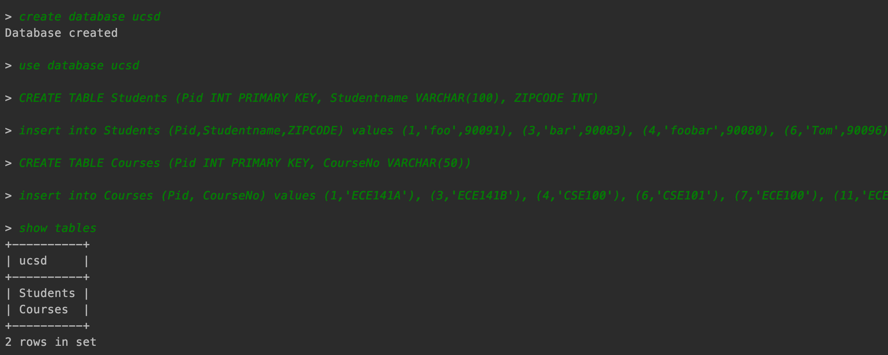
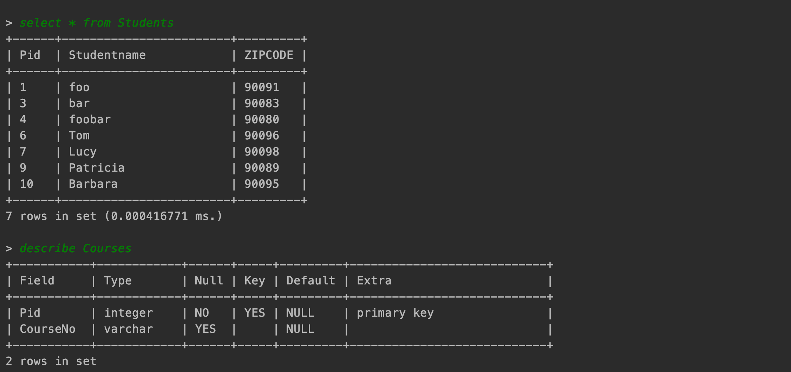
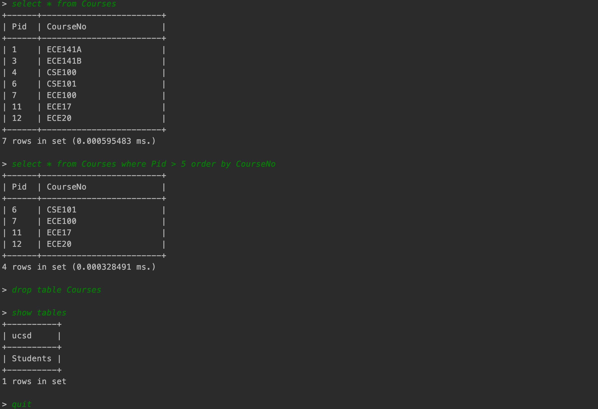
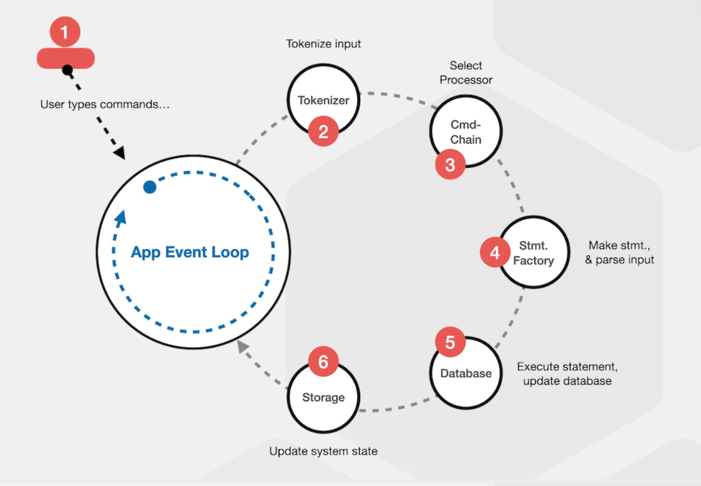

# SQL-Database-Management-System
[](https://github.com/BoscoSuen/SQL-Database-Management-System/blob/master/LICENSE)

It is a SQL database management system based on **C++ 17** and we have created the command parser, low-level storage and database system, and complete many basic SQL commands. More over, we also improved the database management system performance using **Index data blocks** to index some table fields indexing the data blocks, and also add **LRU cache** to improve the data block reading preformance.




## Process Diagram
The architecture for this SQL database management system is based on [**MVC design pattern**](https://en.wikipedia.org/wiki/Model%E2%80%93view%E2%80%93controller) After user input the command, the Tokenizer and Statement class parse the command and construct the Attribute, Schema and Row object, then send them to Database to deal with the SQL command, and also deal with the data with the low-level storage class. After the database controller complete the job, send it to the View object and user can get their SQL command output.


## Usage
You can make the project by
```
make
```
You can find some related help with the SQL database management system:
```
help
```
and you can get following helps:
```
help -- the available list of commands shown below:
	 -- describe database <name>  -- show the description of the database named as name <name>
	 -- use database <name>   -- switch to the database named as name <name>
	 -- drop database <name>   -- delete the database with specific name <name>
	 -- create database <name>  -- create a new database names as input <name>
	 -- quit  -- terminates the execution of this DB application
	 -- show databases  -- shows the list of databases available
	 -- version  -- shows the current version of this application
	 -- help  - shows this list of commands
```
If you are using the system, you can input the SQL commands you want such as:
```
create database db
use database db
CREATE TABLE Students (Pid INT PRIMARY KEY, Studentname VARCHAR(100), ZIPCODE INT)
insert into Students (Pid,Studentname,ZIPCODE) values (1,'foo',90091), (3,'bar',90083)
select * from Students
```
When you finish all input, you can input
```
quit
```
to quit the system.

## RoadMap
- [x] **Built basic command processor**  
- [x] **Built low-level storage system and Database class**  
- [x] **Built Schema and Attribute to deal with input data**  
- [x] **Built Row and Filter class**  
- [x] **Completed select related SQL commands**  
- [x] **Completed table update and delete functions**  
- [x] **Add Index data block to improve performance**  
- [x] **Completed join related functions**  
- [x] **Add LRU cache for storage system to improve performance**  


<!-- LINKS -->

[linkedin-shield]: https://img.shields.io/badge/-LinkedIn-black.svg?style=flat-square&logo=linkedin&colorB=555
[Zhiqiang-url]: https://www.linkedin.com/in/zhiqiang-sun/